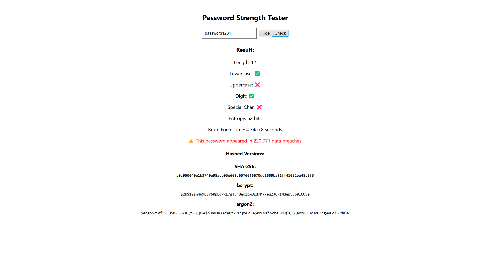

# Password Strength Checker

A full-stack web app to evaluate password strength and detect breaches in real time.

## 🧠 How It Works

This app allows you to:
- Enter any password
- Check its length, entropy, character variety
- See estimated time to crack it (brute-force)
- Check if it has been exposed in a real-world breach using Have I Been Pwned
- View hashed versions (SHA-256, bcrypt, argon2)

---

## ⚙️ Features

✅ Password strength metrics  
✅ Entropy & brute-force time estimator  
✅ HIBP breach check via SHA-1 & k-anonymity  
✅ SHA-256, bcrypt, argon2 hash previews  
✅ Toggle password visibility  
✅ React + Django REST architecture  

---

## 🛠 Technologies Used

### Frontend:
- React
- Axios

### Backend:
- Django
- Django REST Framework
- bcrypt
- argon2-cffi
- requests (for HIBP)

---
### Backend setup:
python -m venv venv
.\venv\Scripts\activate
pip install -r requirements.txt
python manage.py runserver

---
### Frontend setup:
cd frontend
npm install
npm start
